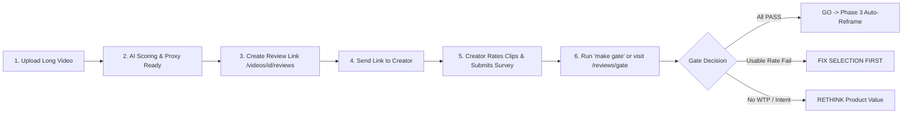

# Creator Reality Check — Operational Protocol (Phase 2.5)

> Quick playbook for running 5 external creator review sessions, testing raw AI clip selection, and making a data-driven Go/No-Go gate decision.

---

## 1. Fast Outreach Message Template (WhatsApp / DM / Email)

```text
Hey [Creator Name]! 👋 

We built an AI engine that extracts the top viral short-form moments from long podcasts and interviews.

I ran your latest video through it and generated 8 raw candidate clips. Could you spend 3 minutes reviewing them?

👉 Private Review Link: [https://clipitup.app/review/TOKEN]

Note: These are raw preview cuts (no captions, framing or editing yet) — we just want your honest gut check on whether the moments themselves are worth posting.

Would love your quick feedback! 🙏
```

---

## 2. 5-Minute Call / Live Session Script (If Running Live)

1. **Context Setting (30 seconds)**:
   > "Thanks for jumping on! Today we're testing whether our AI finds the right moments in your video. The clips you'll see are crude cuts — no subtitles, framing or zooms yet. We want to know: *is this moment intrinsically good enough that with editing you would post it?*"

2. **Clip Rating Flow (3 minutes)**:
   - Ask the creator to share screen or open the link on mobile.
   - For each clip, ask them to hit **Post as is**, **Post with edits**, or **No**.
   - If they pick *Post with edits* or *No*, note which reason chip they pick (`bad_start`, `bad_end`, `no_context`, `boring`, `off_topic`, `too_long`, `too_short`).
   - Let them talk aloud: *"Why did that hook catch or lose you?"*

3. **Exit Questions & Willingness-to-Pay (1.5 minutes)**:
   - *"What single missing feature would make you post these today?"*
   - *"How much time or money do you currently spend cutting shorts every month?"*
   - *"If this gave you 15 ready-to-post clips per video with captions and auto-framing, what would you pay per month?"*
   - *"Would you subscribe at ₹1,500/month? At ₹4,000/month?"*
   - *"Would you upload your next video dropping this week?"*

---

## 3. Question List Checklist

| Question | Goal | Data Field |
| :--- | :--- | :--- |
| **Moment Selection** | Is the core soundbite worth publishing? | `verdict` (`post_as_is`, `post_with_edits`, `no`) |
| **Defect Diagnosis** | What ruined the clip if rejected? | `reason_tag` (`bad_start`, `bad_end`, `no_context`, `boring`, etc.) |
| **Missing Features** | What is needed for immediate publishing? | `missing_text` (Free text) |
| **Current Baseline** | Current cost and time benchmark | `current_workflow_text`, `current_cost_text` |
| **Open Pricing** | Unanchored willingness to pay | `price_open_inr` (₹ INR / month) |
| **Price Tiering** | Validation of ₹1,500 and ₹4,000 pricing | `accepts_1500`, `accepts_4000` (Boolean) |
| **Upload Intent** | Commitment to use on upcoming release | `would_upload_next` (`yes`, `maybe`, `no`), `upload_timeframe` |

---

## 4. How to Run the 5 Sessions



### Step-by-Step Operator Steps:
1. **Upload & Process Video**:
   - Upload the creator's video on Clip-It-Up dashboard (`/dashboard`).
   - Wait for stage 5 `score` to complete.
2. **Generate Private Review Session**:
   - Go to `/videos/[id]/reviews`.
   - Click **Create Review Link**, enter creator's name (e.g. `Aarav Tech`), set expiry (default 14 days), top N (8 clips).
   - Copy the generated private URL (`/review/<token>`).
3. **Send to Creator**:
   - Send the message via WhatsApp/DM using the template above.
4. **Track Live Progress**:
   - Monitor the owner table at `/videos/[id]/reviews` as ratings and exit surveys are saved.
5. **Run Gate Decision**:
   - Run `make gate` in your terminal or navigate to `/reviews/gate` in the browser.
   - Review the generated Markdown report (`eval/reports/gate_<timestamp>.md`) and JSON summary.

---

## 5. Gate Criteria & Thresholds (`config/gate.yaml`)

To pass the Reality Check and proceed to Phase 3 (Face Tracking, Reframe & Subtitles), all 4 checks must pass:

| Check | Threshold | Rationale |
| :--- | :---: | :--- |
| **1. Usable Rate** | **>= 60%** | At least 60% of evaluated clips must be judged postable (`post_as_is` or `post_with_edits`). |
| **2. Postable Breadth** | **>= 4 of 5 Creators** with **>= 2 Postable Clips** | Selection cannot be a hit for only 1 creator; 80% of creators must find at least 2 strong moments per video. |
| **3. Commercial Intent** | **>= 3 of 5 Creators** willing to pay **>= ₹1,500/mo** or commit to upload within 14 days | Validates economic demand before investing in heavy GPU render infrastructure. |
| **4. Negative Reason Dispersion** | **No single "no" reason > 30%** | Ensures there is no single catastrophic defect (e.g., cut off hooks or missing context dominating > 30% of rejections). |

---

## 6. Results Log Template

When logging review notes manually or reviewing the gate output, use this log format:

```markdown
### Creator Session Log: [Creator Name]
- **Date**: YYYY-MM-DD
- **Video Title**: [Title]
- **Review URL**: /review/[token]
- **Status**: Submitted
- **Clips Rated**: 8 / 8
- **Post As-Is**: 3 (37.5%)
- **Post With Edits**: 3 (37.5%)
- **Rejected (No)**: 2 (25.0%)
- **Top Rejection Reasons**: bad_start (1), no_context (1)
- **Open WTP**: ₹2,500 / month
- **Accepts ₹1,500 Tier**: Yes
- **Accepts ₹4,000 Tier**: No
- **Next Video Drop**: Next Tuesday
- **Key Qualitative Quote**: "If it added auto captions with yellow highlights, I wouldn't need my editor for shorts."
```
